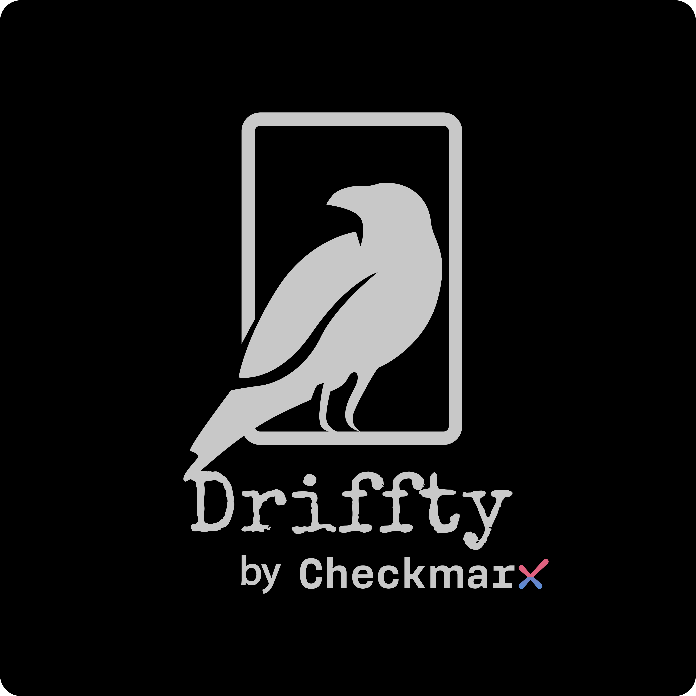

# Driffty

Driffty detects infrastructure drift that could be a source of potential security issues and breaches.

Drift can originate from uncontrolled and manual changes directly within the application environment via web-console or command line, bypassing the automatic deployment.

As we know: we can't handle what we don't know and Driffty can help us to tap into those discrepancies.

So how Driffty does it?

1. Generates Terraform files based on the actual deployment
2. Scans it with KICS to get security posture of it
3. Scan the original IaC to get security posture of it
4. Compare results

This way we focus on what's important - security. 

We don't care about any deviations, but only security-related deviations. Things that really matter.

